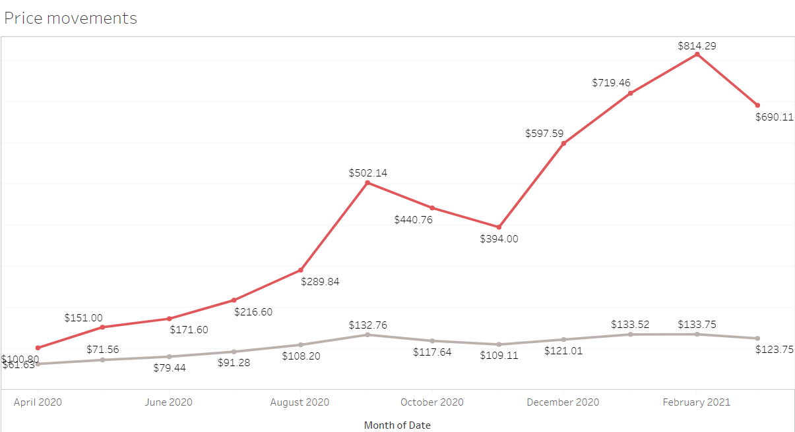
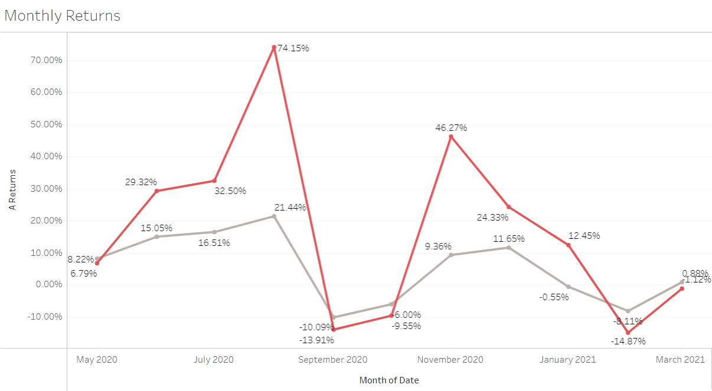

# Efficient Frontier

Efficient Frontier is the set of optimal portfolios that offer the highest expected return for a defined level of risk or\
the lowest risk for a given level of expected return.

In this project, I explore the efficient frontier of a two-stock portfolio consisting of arguably two of the most popular stocks rn, Tesla (NASDAQ: TSLA) and Apple (NASDAQ: AAPL).

Here is the <a href="https://public.tableau.com/app/profile/saran6744/viz/EfficientfrontierforAAPLTSLA/Theefficientfrontier_1" target="_blank" >Link</a> to my visualization.

## How do we graph the efficient frontier?

The efficient frontier rates portfolios (investments) on a scale of return (Y-axis) versus risk (X-axis). The efficient frontier graphically represents portfolios that maximize returns for the risk assumed. Returns are dependent on the investment combinations that make up the portfolio. The standard deviation of a security is synonymous with risk. Ideally, an investor seeks to populate the portfolio with securities offering exceptional returns but whose combined standard deviation is lower than the standard deviations of the individual securities. The less synchronized the securities (lower covariance), the lower the standard deviation. If this mix of optimizing the return versus risk paradigm is successful then that portfolio should line up along the efficient frontier line.

One of the interesting things that we can learn from this concept is the importance of diversification. Optimal portfolios that comprise the efficient frontier tend to have a higher degree of diversification than the sub-optimal ones, which are typically less diversified.

Using this concept, we will essentially try to find an optimal portfolio that could be designed with a perfect balance between risk and return. 
This can be done in two ways: 
- balancing securities with the greatest potential returns with an acceptable degree of risk 
- balancing securities with the lowest degree of risk for a given level of potential return. 

For this project, stocks I have selected are Tesla and Apple.\
The data I used is from the second quarter of 2020 until the second quarter of 2021.\
Let's first look at how the price of each stock has moved within give time frame.
The red line in the chart denotes the price movements of tesla.

Apple seems to more stable and less volatile than tesla.\
Another way to understand the volatility and covariance of the stocks is plotting monthly returns.

As you can see, there is a great covariance between the two stocks.

Now, let's graph the efficient frontier.\
For this, I have considered ten combinations of the two stocks. Starting with 0% TSLA and 100% AAPL and then incrementing ten in TSLA in the subsequent combinations.
I have calculated the standard deviations and returns of each combination. Finally plotting Returns on the Y-axis and Risk on the X-axis.

 
 
Here, portfolios that lie below the efficient frontier are sub-optimal because they do not provide enough return for the level of risk. Portfolios that cluster to the right of the efficient frontier are sub-optimal because they have a higher level of risk for the defined rate of return.

Let's assume a risk-seeking investor uses this efficient frontier to select investments. The investor would select securities that lie on the right end of the efficient frontier. The right end of the efficient frontier includes securities that are expected to have a high degree of risk coupled with high potential returns. Conversely, securities that lie on the left end of the efficient frontier would be suitable for risk-averse investors.

---
I came across this concept while I was doing the financial markets course on Coursera. I thought it will be interesting to plot the frontier myself. So, I did this porject!  
I tried to explain the concept of efficient frontier with just a simple portfolio consisting of just two stocks. I hope you have enjoyed reading this.\
This theory has made many assumptions that are not true in the reality. However, this concept depicts the tremendous benefit of diversification.

Feedback and suggestions are most welcome.\
Data Sources: Yahoo Finance.\
Refernces: Investopedia.
